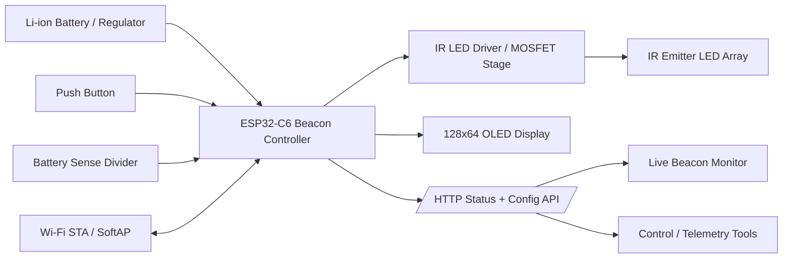
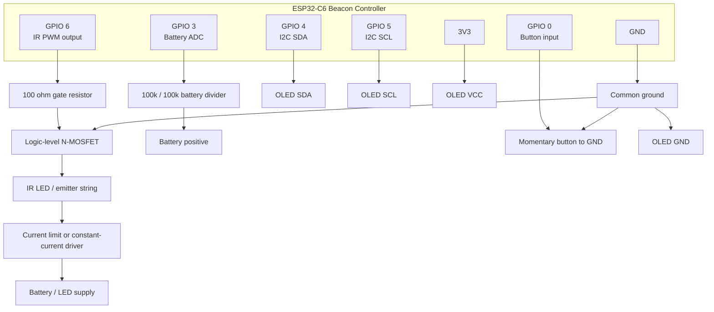
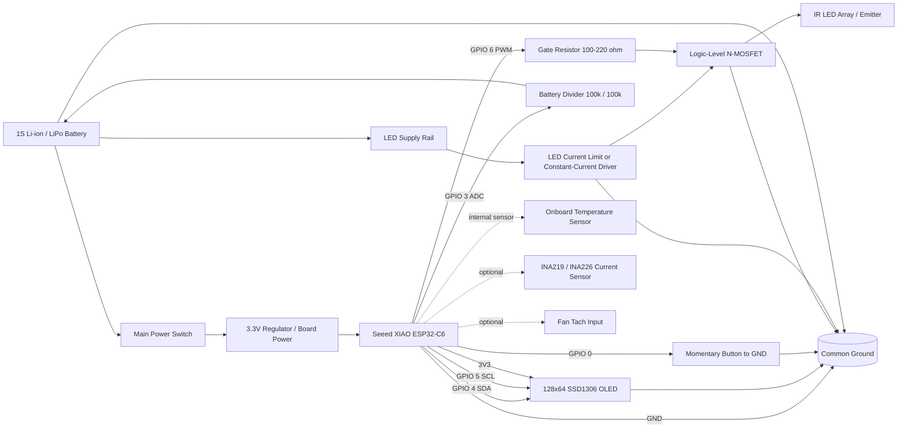

# Automated Followspot System

A comprehensive multi-camera IR beacon tracking system with automated followspot capabilities, designed for live performance applications.

## Features

- **Dual Stack Architecture**: Separate Control and Node stacks for flexible deployment
- **GUI Launcher**: Comprehensive graphical interface for installation, configuration, and management
- **Real-time Video Processing**: WebRTC streaming with low-latency IR beacon detection
- **Multi-Camera Support**: Composite video feeds from multiple camera sources
- **Demo Mode**: Full simulation mode for testing without hardware
- **Automated Installation**: Guided installation process with dependency management
- **System Diagnostics**: Built-in health checks and maintenance tools
- **Debug Telemetry Dashboard**: Simulated node telemetry for debugging and UI validation
- **Built-in Help System**: Independent help window with keyboard shortcuts and operator guidelines

## Quick Start

### 1. Launch the System (GUI by Default)

```bash
python3 launcher.py
# OR
./followspot
```

The system launches with a graphical interface by default, providing:
- Installing Control and Node stacks
- Managing dependencies  
- Configuration management
- System diagnostics
- Running applications

### 2. Command Line Installation (Optional)

For control stack (camera management and tracking):
```bash
python3 setup.py  # Choose option 1
# OR
python3 launcher.py --install-deps control
```

For node stack (camera server):
```bash
python3 setup.py  # Choose option 2
# OR
python3 launcher.py --install-deps node
```

For the front truss node (IMX477/RS485 build):
```bash
python3 launcher.py --install-deps front-node
```

During either node installation you'll be prompted for static IP, hostname, camera device, and port information. The launcher captures those values, writes network setup notes, and provisions a user-level systemd service so the node boots automatically.

### 3. Quick Launch Options

```bash
# Launch GUI interface (default behavior)
python3 launcher.py
./followspot

# Use industrial command-line launcher
python3 launcher.py --cli   # or -cli
./followspot --cli

# Launch camera configuration
python3 launcher.py --configure
./followspot --configure

# Run in demo mode (no hardware required)
python3 launcher.py --demo
./followspot --demo

# Run live mode
python3 launcher.py --run
./followspot --run

# Check system status
python3 launcher.py --status
./followspot --status

# Install the front truss node stack headlessly
python3 launcher.py --install-deps front-node

# Start node server
python3 launcher.py --node
./followspot --node
```

## System Architecture

## System Architecture

### Control Stack
The control stack manages camera feeds, performs IR beacon detection, and provides the user interface:

- **Camera Aggregator**: Manages multiple camera connections via WebRTC
- **IR Beacon Detection**: Real-time detection and tracking algorithms
- **ReID Processing**: Person Re-Identification with OSNet embeddings
  - CoreML Neural Engine acceleration on Apple Silicon
  - TensorRT FP16 optimization on NVIDIA Jetson
- **Data Fusion**: Kalman filter fusion of IR beacon + ReID tracks
- **Spotlight Controller**: Computes pan/tilt from fused positions
- **Configuration GUI**: Camera setup and calibration interface
- **Video Display**: Composite video output with overlay information
- **Demo Mode**: Simulated cameras with moving beacons for testing
- **3D Visualization**: Real-time 3D stage rendering with matplotlib
- **Help System**: Independent help window accessible via Help menu or 'H' key

**Key Files:**
- `control/main.py` - Main application entry point
- `control/camera_aggregator.py` - Multi-camera management
- `control/camera_config_gui.py` - Configuration interface
- `control/video_display_gui.py` - Video display GUI
- `control/demo_mode.py` - Demo/simulation mode
- `control/reid_runner.py` - ReID pipeline (detect + embed + track)
- `control/reid_processor.py` - Optimized OSNet + YOLOv8 pipeline
- `control/person_tracker.py` - Appearance + geometry tracking
- `control/fused_main.py` - IR + ReID + Kalman fusion
- `control/spotlight_controller.py` - Pan/tilt computation + DMX
- `visualization_3d.py` - 3D stage rendering with matplotlib

### Node Stack
The node stack runs on camera devices (typically Raspberry Pi) to stream video:

- **Camera Server**: WebRTC streaming server for camera feeds
- **Hardware Integration**: Raspberry Pi camera module support
- **Network Streaming**: Low-latency video transmission
- **Remote Management**: Command-line interface for headless operation
- **DMX Output**: RS485/Art-Net/sACN for fixture control
- **Health Monitoring**: `/health` endpoint with psutil stats

**Key Files:**
- `node/server.py` - Camera streaming server
- `node/dmx_transport.py` - DMX512/Art-Net/sACN transports
- `node/dmx_transport.py` - DMXEncoder with fixture profiles
- `node/README.md` - Node-specific documentation

Run the front truss node on a Raspberry Pi with the HQ (IMX477) camera and RS485 HAT using the dedicated profile:

```bash
python3 node/server.py --profile front_truss --port 8000
```

The DMX endpoint (`/dmx`) is wired but returns a placeholder response until RS485 output is ready.

## IR Beacon Build Schematic

The IR beacon is the data source for the live monitor. It combines an ESP32-C6, an IR LED output stage, an OLED status display, a user button, and a battery sense path so the beacon can report both identity and health over Wi-Fi.

### Functional Block Diagram



### Recommended Parts

| Part | Purpose | Notes |
| --- | --- | --- |
| Xiao ESP32-C6 or equivalent ESP32-C6 board | Main controller | Runs the beacon firmware and Wi-Fi stack |
| IR LED array | Beacon emission | Use a current-limited IR emitter suitable for stage distance |
| Logic-level MOSFET or transistor stage | Switches the IR LEDs | Drive from the ESP32 GPIO, do not power LEDs directly from the MCU pin |
| 128x64 OLED display (SSD1306 over I2C) | Local status UI | Shows ID, battery, Wi-Fi, menu, and warning states |
| Momentary push button | Local control | Used for menu cycling and ID / brightness control |
| Li-ion battery pack | Portable power | Size for runtime and peak LED current |
| Battery divider network | Voltage sensing | Scales pack voltage into the ADC range |
| Onboard XIAO temperature sensor | Extended telemetry | Provides `temp_c` without any extra sensor module |
| Optional current sensing module | Extended telemetry | Useful if you want true current data on the live monitor |

### Wiring Overview

The firmware currently assumes these core connections:

| Signal | ESP32-C6 Pin | Destination | Purpose |
| --- | --- | --- | --- |
| `IR LED PWM` | GPIO 6 | MOSFET gate / LED driver | Pulses the IR beacon output |
| `VBAT sense` | GPIO 3 | Battery divider midpoint | Reads pack voltage for battery percentage |
| `Button` | GPIO 0 | Momentary switch to GND | Menu / brightness / ID control |
| `I2C SDA` | GPIO 4 | OLED SDA | Display data |
| `I2C SCL` | GPIO 5 | OLED SCL | Display clock |
| `3V3` | Board 3V3 | OLED power / logic side | Low-voltage logic rail |
| `GND` | Board GND | Shared ground | Common return for all stages |

### Pin-By-Pin Schematic

This is the practical build map for the current firmware. Keep the wiring short and route the power path separately from the I2C and button leads.



### Full Hookup Diagram

This is the end-to-end hookup for a single beacon. It shows the power chain, controller, sensing, and emitter path together so you can wire the whole unit without guessing at the ground or current return.



#### Full Hookup Notes

| Area | What to Wire | Notes |
| --- | --- | --- |
| Battery input | Battery pack to main power switch, then to the regulator and LED rail | Split the logic supply and LED supply if your current draw is high |
| Controller power | Regulated 3.3V to the XIAO and OLED | Keep the logic rail clean and decoupled |
| IR emitter path | LED rail through the driver stage, then into the IR LED array | Use a current-limited driver, not a direct GPIO drive |
| Gate drive | XIAO GPIO 6 through the gate resistor to the MOSFET | Keeps switching reliable and protects the pin |
| Battery sensing | XIAO GPIO 3 to the divider midpoint | Firmware expects a 1:1 divider |
| Button input | XIAO GPIO 0 to a momentary switch that pulls to ground | Uses internal pull-up logic |
| OLED display | XIAO GPIO 4 and 5 plus 3V3 and GND | Standard I2C wiring |
| Temperature sensing | XIAO onboard sensor | No external wiring required |
| Current sensing | Optional INA219 / INA226 on the power path | Add only if you want true current telemetry |
| Fan sense | Optional tach input | Only needed if the enclosure is actively cooled |

#### Assembly Order

1. Build the power path first and verify the regulator output before connecting the XIAO.
2. Add the OLED and confirm the boot screen appears.
3. Wire the button and confirm menu entry and brightness cycling.
4. Wire the MOSFET and IR LED stage and verify the beacon pulses at the expected frequency.
5. Add the battery divider and confirm the live battery percentage is sane.
6. If used, wire current sensing on the LED rail and verify `current_a` updates in the status payload.
7. Mount the enclosure, then keep the high-current LED wiring away from the OLED and button lines.

#### Recommended Electrical Values

| Subsystem | Recommended Value | Why |
| --- | --- | --- |
| MOSFET gate resistor | 100 ohm to 220 ohm | Softens GPIO edge current and keeps switching stable |
| MOSFET gate pulldown | 100k ohm | Keeps the IR LED driver off during boot |
| Battery divider | 100k ohm top / 100k ohm bottom | Matches the firmware’s 1:1 divider assumption and keeps 4.2V within ADC range |
| Button pull-up | Internal pull-up or 10k external | The firmware uses `INPUT_PULLUP`, so the button should short to ground on press |
| I2C pull-ups | Usually already on OLED module | Add 4.7k if your display board does not include them |
| IR LED current limit | External constant-current driver preferred | Keeps brightness stable and prevents thermal runaway |

#### Optional Sense Hardware

If you want the “sense” fields to be real instead of placeholders, add these modules on the same I2C bus or power path:

| Sense Device | Interface | Suggested Part | Notes |
| --- | --- | --- | --- |
| Current sensor | I2C | INA219 or INA226 | Reads beacon LED supply current for `current_a` |
| Temperature sensor | Onboard MCU sensor | XIAO ESP32-C6 internal temperature sensor | Feeds `temp_c` without extra wiring or an external module |
| Fan tach input | Digital pulse | 2-wire or 3-wire fan with tach output | Feeds `fan_rpm` if you use an actively cooled enclosure |

### Reference Schematic Notes

| Node | Connection | Detail |
| --- | --- | --- |
| ESP32 GPIO 6 | MOSFET gate | PWM pulse output for the IR beacon |
| MOSFET drain | IR LED negative path | Switch the low side of the emitter current |
| MOSFET source | Common ground | Shared with ESP32, OLED, and battery divider |
| IR LED positive path | Battery or regulated LED rail | Use a dedicated current-limited path |
| ESP32 GPIO 3 | Divider midpoint | Analog input for battery voltage sensing |
| ESP32 GPIO 0 | Button to GND | Long press enters menu, short press cycles menu items |
| ESP32 GPIO 4 / 5 | OLED SDA / SCL | I2C status display |
| ESP32 3V3 / GND | OLED VCC / GND | Power for the display logic side |

For a clean enclosure build, keep the high-current IR emitter wiring away from the OLED and button traces, and tie all grounds to a single star point near the controller or power entry.

### Sense Chain

The beacon is not just an emitter; it is a sensor node that reports its own health back to the software. The current telemetry pipeline is built around these values:

| Sense Item | Source | Where It Appears |
| --- | --- | --- |
| Battery voltage | ADC measurement of the divider on `VBAT` | OLED, `/api/status`, live monitor |
| Battery percent | Derived from voltage map | OLED, `/api/status`, warnings |
| Wi-Fi RSSI | Measured by the Wi-Fi stack | `/api/status`, live monitor |
| Wi-Fi SSID | Connected network name or fallback AP name | `/api/status`, live monitor |
| Uptime | `millis()` converted to seconds | `/api/status`, diagnostics |
| LED enabled state | Firmware state flag | OLED, `/api/status`, monitor |
| Brightness percentage | Menu-controlled PWM level | OLED, `/api/status`, monitor |
| Current / temperature | Current sensor optional; temperature comes from XIAO onboard sensing | Ready for future sensor expansion |
| Fan RPM | Telemetry placeholder | Ready for future enclosure cooling or driver-board sensing |

If you add real current, temperature, or fan sensing hardware, keep the same field names in the status payload so the monitor can use them without a software rewrite.

### Reference BOM

This is a practical starting list rather than a locked purchasing list.

| Item | Suggested Spec | Example |
| --- | --- | --- |
| ESP32-C6 controller | Wi-Fi + GPIO + ADC | Seeed Xiao ESP32-C6 or similar |
| OLED | 128x64 SSD1306 I2C | 0.96 inch or 1.3 inch module |
| IR emitter | High-output IR LED or LED cluster | 850 nm or 940 nm depending on camera sensitivity |
| LED driver | Logic-level N-MOSFET or constant-current driver | AO3400-class MOSFET for switching, or a proper current-regulated stage |
| Gate resistor | 100 ohm | Mounted close to the MOSFET gate |
| Gate pulldown | 100k ohm | Prevents random startup flashes |
| Battery divider resistors | 100k ohm + 100k ohm | Matched pair for battery sense |
| Button | Momentary tactile switch | Panel or enclosure mount |
| Battery pack | 1-cell Li-ion / LiPo | Size for runtime and peak LED current |
| Current sensor | INA219 / INA226 | Optional, for true `current_a` telemetry |
| Temp source | XIAO ESP32-C6 onboard sensor | Built in; no extra BOM item required |
| Fan | 5V or 12V enclosure fan with tach | Optional, for true `fan_rpm` telemetry |

### Firmware Features

The beacon firmware now includes:

**INA219 Current Sensor Support**
- Auto-detects INA219 at I2C address 0x40 on startup
- Reads `current_mA` from LED supply rail (high-side)
- Calibration: `INA219_SHUNT_OHMS = 0.1` (adjust for your shunt resistor)
- Reports `current_a` in `/api/status` telemetry

**ESP32-C6 Internal Temperature Sensor**
- Uses `temperatureRead()` (Arduino ESP32 core ≥ 3.0)
- Reports die temperature as `temp_c` in telemetry
- No external wiring required

**Fan Tachometer Support**
- Connect fan tach output to `PIN_FAN_TACH` (default GPIO 7)
- Counts falling edges, computes RPM (2 pulses/rev for typical fans)
- Reports `fan_rpm` in telemetry
- Auto-detects at startup

**OTA Firmware Updates**
- Endpoint: `POST /api/ota` with JSON `{"url": "http://host/firmware.bin"}`
- Uses Arduino `HTTPUpdate` library
- Verifies firmware size, writes to flash, auto-restarts on success
- Trigger from Python: `push_ota(beacon, firmware_url)`

### Reference Schematic Notes

1. Mount the ESP32-C6 board in the enclosure with access to USB and the button.
2. Wire the OLED over I2C with short leads and a solid ground reference.
3. Wire the IR LED stage through a MOSFET or transistor driver and confirm the LED current is externally limited.
4. Add the battery divider to the ADC input and verify the pack voltage stays in the ADC-safe range.
5. Connect the button with pull-up logic so a press pulls the pin low.
6. Flash the firmware and confirm the boot screen, live dashboard, menu, and warning pages render correctly.
7. Join the beacon to Wi-Fi, then check the live monitor for the nested telemetry object and the health fields.

### Telemetry Contract

The beacon publishes a status payload to `/api/status` with a nested `telemetry` object so the monitor can show the device even when it is offline or not fully connected. The important fields are:

- `battery_v`
- `battery_pct`
- `current_a`
- `temp_c`
- `fan_rpm`
- `brightness_pct`
- `uptime_s`
- `wifi_rssi_dbm`
- `wifi_ssid`
- `led_enabled`

The same device also accepts posted telemetry on `/api/telemetry` so external sense data can be stored and displayed later.

The same device also accepts posted telemetry on `/api/telemetry` so external sense data can be stored and displayed later.

### Beacon OTA & Telemetry

The beacon firmware now supports over-the-air firmware updates and extended telemetry:

**OTA Firmware Updates**
- Endpoint: `POST /api/ota` with JSON `{"url": "http://host/firmware.bin"}`
- Uses Arduino `HTTPUpdate` library with `WiFiClient`
- Verifies firmware size, streams to flash, auto-restarts on success
- Python trigger: `push_ota(beacon, firmware_url)` in `beacon_network.py`

**Extended Telemetry (Real Sensors)**
- `current_a` - INA219 high-side current sensor on LED rail (mA)
- `temp_c` - ESP32-C6 internal die temperature sensor
- `fan_rpm` - Fan tachometer on GPIO 7 (2 pulses/rev)

Sensors auto-detect at startup; missing sensors report as `0`/`null` in JSON.

### Practical Notes

```bash
python3 launcher.py --cli
```

Follow the on-screen menu or run `python3 launcher.py --install-deps front-node` directly for unattended scripts.

### Launcher System
Unified management interface for both stacks:

- **GUI Launcher** (`launcher_gui.py`): Full graphical management interface
- **CLI Launcher** (`launcher.py`): Industrial text console for headless installs
- **Setup Script** (`setup.py`): Dependency installation utility
- **Configuration** (`launcher_config.json`): System state tracking

## Installation Modes

### Control Stack Installation
When you install the Control Stack, the launcher provides these options:

1. **Launch Configuration**: Set up camera connections and layout
2. **Offline Mode**: Run with demo cameras (no hardware required)
3. **Live Mode**: Connect to real cameras for operation

Additional maintenance options:
- Repair installation (reinstall dependencies)
- Uninstall stack

### Node Stack Installation
When you install the Node Stack, the launcher provides these options:

1. **Start/Stop Node Server**: Manual server control
2. **Add to Cron**: Automatic startup at boot (Linux/Pi)
3. **Diagnostics**: System health checks
4. **Repair**: Reinstall dependencies
5. **Reinstall**: Complete reinstallation
6. **Uninstall**: Remove stack

## Configuration

### Camera Configuration
Use the configuration GUI to set up cameras:

```bash
python3 launcher.py --configure
```

Configuration includes:
- Camera server URLs (WebRTC endpoints)
- Crop rectangles for each camera
- Grid layout and positioning
- IR detection parameters

## Debugging Information

The launcher includes a simulated telemetry dashboard for debugging the node and beacon workflow without live hardware.

For a focused guide, see [docs/debugging_information.md](docs/debugging_information.md).

Open it from the GUI launcher via `Tools -> Debug Telemetry Dashboard`, or run it directly with:

```bash
python3 control/debug_telemetry_dashboard.py
```

The dashboard shows:

- Node identity fields: ID, IP, and MAC address
- Synthetic electrical and thermal data
- Raw hex payload output for packet-level inspection
- A copy-to-clipboard snapshot for sharing debug state during troubleshooting

## Front Camera Calibration (Complete Guide)

Accurate XYZ tracking and spotlight tilt depend on a precise calibration of the front ReID camera. Follow the end-to-end workflow below whenever you install the system in a new venue or move the camera rig.

### 1. Understand the Coordinate System

- **Stage origin**: The point $(0, 0, 0)$ sits on the stage floor. By default, the $+X$ axis runs to stage right, $+Y$ toward upstage (away from the audience), and $+Z$ points upward.
- **Camera frame**: The ReID camera reports detections in its own 3D frame. Calibration computes a rotation matrix and translation vector that map those detections into stage coordinates.
- **Spotlight rig**: The spotlight controller assumes the same stage origin, so camera misalignment directly affects pan/tilt accuracy.

### 2. Gather Tools and Measurements

| Item | Purpose |
| --- | --- |
| Tape measure or laser rangefinder | Measure camera height and offsets from stage origin |
| Inclinometer or protractor | Measure camera tilt if you are not running the automated calibration |
| Laptop with the configurator | Enter values and capture calibration points |
| Clearly marked stage corners | Improve click accuracy during calibration |

Record the following before you open the configurator:

- Stage width, depth, and height
- Desired stage origin (often center front edge or downstage-left corner)
- Camera position relative to the origin (X/Y on the floor plane, Z for height)
- Approximate camera pitch (tilt downward). Note the yaw (rotation around Z) if it is not facing straight downstage.

### 3. Enter Stage Geometry

1. Launch the front camera configurator:
  ```bash
  python3 launcher.py --configure
  ```
2. Open the **Stage Geometry** tab.
3. Fill in the stage width, depth, and height in meters.
4. Set the origin coordinates to the physical point you chose. If you want the origin at the front-center of the stage, use `X = 0`, `Y = 0`, and `Z = 0`. For a downstage-left corner origin, set `X = -width/2`, `Y = 0`, `Z = 0`, etc.
5. Click **Save Configuration** to persist the updated stage definition.

### 4. Capture Stage Corners (2D Reference)

1. In the **Camera Preview** panel, start the camera feed (or load a still image if you have one captured from the same pose).
2. Press **Calibrate**. You will be prompted to click the four stage corners in this order:
  1. Front-left (downstage left)
  2. Front-right (downstage right)
  3. Back-right (upstage right)
  4. Back-left (upstage left)
3. Click carefully; the pixel selections establish the homography used for downstream alignment.
4. When all four points are selected, the configurator timestamps the run and marks `calibration.calibrated = true` in `front_array_config.json`.

### 5. Solve the Camera Extrinsics (3D Pose)

Two options give you the Z alignment the fusion pipeline needs:

#### A. Quick Manual Entry

1. Still in **Front Node Settings**, locate **Camera Position (X, Y, Z m)**. Enter the measured offsets from the stage origin.
2. Set **Camera Angle (deg)** to the measured pitch. Positive values tip the camera toward the stage.
3. If the camera is yawed (rotated left/right), update the yaw inside the **Rotation Matrix** (see table below for help editing matrices manually).

This approach is suitable when you only need approximate Z values or you have highly accurate measurements from rigging drawings.

#### B. Calibration Matrix Workflow (Recommended)

1. After recording the stage corners, measure three or more distinct reference points on the stage (for example, known marks or spike strips) and note their stage coordinates.
2. Enter each reference point in the **Calibration** panel of the configurator (under `calibration.reference_points`).
3. Use the guidance in `docs/front_camera_z_calibration.md` to run the projection solver. The solver updates `camera.front_camera.extrinsics.rotation_matrix` and `translation_vector`, and marks the set as calibrated.
4. Press **Save Configuration** once the solver completes. The fusion layer will now treat the extrinsics as authoritative and ignore the simple `angle` field.

### 6. Verify Depth in the Fusion View

1. Launch the fused control loop (`python3 control/fused_main.py`) or start the system via the launcher.
2. Watch the fused person coordinates. A performer centered at stage origin should report `X ≈ 0`, `Y ≈ 0`. When they walk upstage, the Y value should increase. A tall performer and a short performer should produce sensible Z differences (around their actual height).
3. If the Z value is mirrored or sign-flipped, revisit the rotation matrix—swap axes or adjust signs until upstage/downstage behave correctly.

### 7. Align the Spotlight Rig

Once the camera pose is correct, open the **Spotlight Rig** tab in the configurator:

1. Enter the fixture position, stage origin repeat, and zero angles as measured.
2. Set the same origin reference you used for the camera so both systems align.
3. Save the configuration; `config/spotlight_config.json` is written alongside `front_array_config.json`.

### 8. Final Checklist

- [ ] `front_array_config.json` contains the measured stage geometry and extrinsics with `calibrated: true`.
- [ ] `spotlight_config.json` matches the same stage origin so pan/tilt math is consistent.
- [ ] Operators can run **Test System** in the configurator to ensure configuration sanity before a show.
- [ ] Optional: keep a copy of the JSON files in `backups/` once calibration is verified.

### Reference: Editing the Rotation Matrix Manually

The rotation matrix follows the standard right-handed convention. If you need to adjust it manually:

| Desired effect | Matrix edit |
| --- | --- |
| Tilt camera down by angle θ | Multiply the first row/column by the rotation matrix $R_x(θ)$ |
| Yaw camera toward audience left | Apply $R_z(+θ)$ |
| Roll camera clockwise | Apply $R_y(-θ)$ |

Combine rotations by multiplying the matrices (order matters). The solver described above automates this, so manual edits are typically only necessary for quick tweaks.

For a printable, no-fiducial walkthrough see `docs/front_camera_z_calibration.md`. That guide also covers an optional high-precision photogrammetry workflow if you ever need to step up from the tape-measure method.

### Example Configuration File (`roof_array_config.json`):
```json
{
  "cameras": [
    {
      "server_url": "http://192.168.1.100:8080",
      "crop_rect": [0, 0, 640, 480],
      "position": [0, 0],
      "camera_id": "cam_1",
      "enabled": true
    }
  ],
  "grid_config": {
    "cameras_per_row": 2,
    "total_cameras": 4,
    "cell_width": 320,
    "cell_height": 240
  }
}
```

## Usage Modes

### Demo Mode
Perfect for testing and development without hardware:
- Simulated moving IR beacons
- Multiple virtual cameras
- All detection and tracking features work
- No network or hardware requirements

```bash
python3 launcher.py --demo
```

### Live Mode
Connect to real cameras for production use:
- WebRTC streaming from camera nodes
- Real-time IR beacon detection
- Composite video from multiple cameras
- Interactive controls and overlays

```bash
python3 launcher.py --run
```

### Node Server Mode
Run camera server on Pi or other devices:
- Streams video via WebRTC
- Handles camera hardware
- Can run headless
- Supports auto-start via cron

```bash
python3 launcher.py --node
```

## ReID Acceleration

### Apple Silicon (CoreML / Neural Engine)
Enable Neural Engine acceleration for OSNet ReID embeddings:

```json
// config/reid_config.json
"optimization": {
  "coreml_reid_enabled": true,
  "coreml_model_path": "reid/models/osnet_x0_5.mlpackage",
  "coreml_compute_unit": "CPU_AND_NE",
  "coreml_skip_torch": true
}
```

Convert OSNet to CoreML:
```bash
python3 tools/convert_osnet_coreml.py --output reid/models/osnet_x0_5.mlpackage
```

**Compute Units:**
- `CPU_AND_NE` - Neural Engine (lowest power)
- `CPU_AND_GPU` - Metal GPU
- `ALL` - Automatic
- `CPU_ONLY` - CPU fallback

### NVIDIA Jetson (TensorRT)
Export OSNet to TensorRT engine for Jetson:

```bash
python3 tools/export_tensorrt.py --model osnet_x0_5 --output reid/models/osnet_x0_5.engine --fp16
```

Options:
- `--precision fp16|fp32|int8`
- `--max-batch 32`
- `--workspace 1GB`

## Configuration Validation

All configuration files validated against JSON Schema:

```bash
python3 tools/validate_config.py
```

Validates:
- `config/front_array_config.json`
- `config/roof_array_config.json`
- `config/spotlight_config.json`
- `config/reid_config.json`

Auto-generate documentation from schemas:
```bash
python3 tools/generate_config_docs.py
```
Outputs Markdown to `docs/config/`.

## Structured Logging

Structured JSON logging with correlation IDs:

```python
from utils.logging import setup_logging, info, error

logger = setup_logging("my_service", level=logging.INFO)
info(logger, "Processing frame", frame_id=42, detections=3)
```

Output:
```json
{"timestamp":"2026-07-19T14:30:00.123Z","level":"INFO","service":"my_service","trace_id":"a1b2c3d4","logger":"my_service","message":"Processing frame","extra":{"frame_id":42,"detections":3}}
```

Correlation IDs propagate across async boundaries via `contextvars`.

## 3D Visualization

Real-time 3D stage visualization with matplotlib backend:

```bash
python3 visualization_3d.py --demo
```

Features:
- **Stage3D**: Stage geometry with floor grid, walls, and origin marker
- **Spotlight3D**: Fixture position, beam cone visualization with pan/tilt
- **Camera3D**: Camera positions with frustum visualization
- **Person3D**: Tracked performers with velocity vectors and trails
- **Real-time animation** with matplotlib FuncAnimation
- **Demo mode** with simulated performers and spotlight tracking

To integrate with live data, use the `Visualization3DServer` class to receive real-time updates via WebSocket.

## DMX Output Pipeline

Complete DMX512 output pipeline for driving moving-head fixtures:

**Transports:**
- **RS485 Serial** - 250kbps DMX512 with break/MAB timing
- **Art-Net** - UDP broadcast to Ethernet-DMX gateways
- **sACN/E1.31** - Multicast streaming ACN
- **Stub** - Testing without hardware

**Configuration** (`config/spotlight_config.json`):
```json
"dmx": {
  "transport": "rs485_serial",
  "serial_port": "/dev/ttyAMA0",
  "universe": 1,
  "fixture_profile": "config/fixture_profiles.json"
}
```

**Fixture Profiles** (`config/fixture_profiles.json`):
- Generic Moving Head (pan/tilt 16-bit, dimmer)
- Generic LED PAR
- Robinte Mega Pointe (25 channels)

The `DMXEncoder` converts pan/tilt/brightness to 512-channel frames using fixture channel mapping.

## System Requirements

### Control Stack
- Python 3.7+
- OpenCV (opencv-python)
- NumPy
- aiohttp
- aiortc
- Pillow (PIL)
- Tkinter (usually included with Python)

### Node Stack
- Python 3.7+
- Flask
- OpenCV (opencv-python)
- NumPy
- aiohttp
- aiortc
- picamera2 (Raspberry Pi only)
- scikit-image
- requests

### Platform Support
- **Control Stack**: Windows, macOS, Linux
- **Node Stack**: Linux (optimized for Raspberry Pi)
- **Launcher**: Cross-platform GUI and CLI

## Apple Silicon Acceleration

The control stack now detects Apple Silicon hardware automatically, and the launcher's **Settings → ReID Acceleration** panel lets you toggle these options without editing JSON files:

- **Metal (MPS)**: When PyTorch is installed with MPS support, all detector and ReID models run on the GPU without any configuration changes.
- **Neural Engine (Core ML)**: For the lowest power draw, you can supply a Core ML version of the ReID embedding model and enable it in `config/reid_config.json`:

  Available accelerator modes:
  - **Neural Engine (ANE)** → `CPU_AND_NE`
  - **GPU (Metal)** → `CPU_AND_GPU`
  - **CPU only** → `CPU_ONLY`
  - **Automatic (All accelerators)** → `ALL`

  ```json
  "optimization": {
    "coreml_reid_enabled": true,
    "coreml_model_path": "reid/models/osnet_x0_5.mlpackage",
    "coreml_compute_unit": "CPU_AND_NE",
    "coreml_skip_torch": true
  }
  ```

  1. Install Core ML tooling (optional, only needed to use the Neural Engine):

     ```bash
     pip install coremltools==6.4
     ```

  2. Convert your ReID PyTorch checkpoint to Core ML (for example, with `coremltools.convert` or a custom script) and place the produced `.mlpackage` in `reid/models/`.

  3. Toggle `coreml_reid_enabled` to `true`. You can do this visually from the launcher or by editing the JSON directly. The loader will verify the model on startup and fall back to the Torch backend if anything goes wrong.

When Core ML is active, Torch-based ReID inference can be skipped entirely (`coreml_skip_torch: true`) so the pipeline uses only the Neural Engine for embeddings while the detector continues to run on MPS.

## Troubleshooting

### Common Issues

1. **Dependencies Missing**
   ```bash
   python3 launcher.py --check-deps all
   python3 setup.py  # Reinstall dependencies
   ```

2. **Camera Connection Failed**
   - Check network connectivity
   - Verify camera server URLs
   - Try demo mode first: `python3 launcher.py --demo`

3. **GUI Won't Start**
   ```bash
   python3 launcher.py  # Use CLI interface
   ```

4. **No Video Display**
   - Check if running in headless environment
   - Use `--dry-run` flag for headless operation
   - Verify camera configuration

### Diagnostics
Use built-in diagnostics to check system health:

```bash
python3 launcher.py --status          # Overall system status
python3 launcher.py --check           # Quick dependency check
python3 launcher.py --gui             # GUI diagnostics tools
```

### Log Files
Terminal output can be saved from the GUI launcher for debugging.

## Development

### Project Structure
```
Automated-Followspot-System/
├── launcher.py              # Industrial CLI launcher
├── launcher_gui.py          # GUI launcher
├── setup.py                # Dependency installer
├── launcher_config.json    # System configuration
├── config/
│   ├── roof_array_config.json   # Roof array camera configuration (primary)
│   └── front_array_config.json  # Front array camera configuration (placeholder)
├── control/                # Control stack
│   ├── main.py
│   ├── camera_aggregator.py
│   ├── camera_config_gui.py
│   ├── video_display_gui.py
│   ├── demo_mode.py
│   └── requirements.txt
├── node/                   # Node stack
│   ├── server.py
│   ├── requirements.txt
│   └── README.md
└── README.md
```

### Contributing
1. Fork the repository
2. Create a feature branch
3. Make your changes
4. Test with both stacks
5. Submit a pull request

## License

This project is licensed under the GNU Affero General Public License v3.0. See the `LICENSE` file for details.

## Support

- **Documentation**: This README and inline help
- **Issues**: [GitHub Issues](https://github.com/Stavro-Purdie/Automated-Followspot-System/issues)
- **Discussions**: [GitHub Discussions](https://github.com/Stavro-Purdie/Automated-Followspot-System/discussions)

## Acknowledgments

Built for live performance applications requiring precise automated lighting control and tracking.
